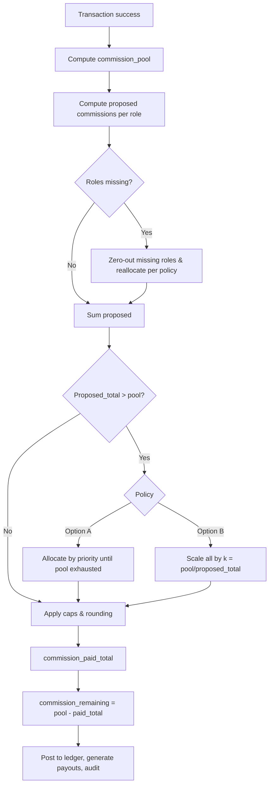

# FLOW PHÂN BỔ HOA HỒNG CHO GIAO DỊCH THÀNH CÔNG

> Tài liệu hướng dẫn chuẩn hoá cách tính và phân bổ hoa hồng theo mô tả bạn cung cấp. Có thể dùng làm spec cho dev/ops, làm SOP cho kế toán, hoặc đính kèm hợp đồng bán hàng.

---

## 1) Mục tiêu
- Xác định **tổng quỹ hoa hồng** cho mỗi giao dịch thành công.
- Phân bổ minh bạch cho các bên: **bán hàng trực tiếp**, **người giới thiệu**, **đầu chủ** (người ký nhập sản phẩm), và **các cấp quản lý**: quản lý kinh doanh (QLKD), quản lý sản phẩm/dự án (QLSP/DA), quản lý tỉnh thành/khu vực (QLKV).
- Tính **hoa hồng còn lại** = **Tổng quỹ** − **Hoa hồng đã chi**.
- Hỗ trợ rule khi **quỹ không đủ** và **làm tròn/giới hạn (cap)**.

---

## 2) Đầu vào bắt buộc
- `gross_value` – Tổng giá trị giao dịch (VND).
- `commission_pool_rate` – % quỹ hoa hồng trên giá trị giao dịch (ví dụ 5%).
- Tỷ lệ (có thể cấu hình) cho từng đối tượng:
  - `rate_direct_sales` – % cho người bán trực tiếp.
  - `rate_referrer` – % cho người giới thiệu.
  - `rate_head_owner` – % cho đầu chủ.
  - `rate_mgr_sales` – % cho QLKD.
  - `rate_mgr_product` – % cho QLSP/DA.
  - `rate_mgr_region` – % cho QLKV.
- **Tuỳ chọn**: ưu tiên chi trả, quy tắc làm tròn, trần (cap) mỗi vai trò, điều kiện không có người/không đủ thông tin.

---

## 3) Biến & công thức
- `commission_pool = gross_value * commission_pool_rate`  
- Hoa hồng đề xuất cho từng vai trò (pre-allocation):
  - `c_direct = gross_value * rate_direct_sales`
  - `c_ref = gross_value * rate_referrer`
  - `c_head = gross_value * rate_head_owner`
  - `c_mgr_sales = gross_value * rate_mgr_sales`
  - `c_mgr_product = gross_value * rate_mgr_product`
  - `c_mgr_region = gross_value * rate_mgr_region`
- `commission_proposed_total = c_direct + c_ref + c_head + c_mgr_sales + c_mgr_product + c_mgr_region`

### 3.1) Điều chỉnh nếu tổng đề xuất > quỹ
**Hai lựa chọn (chọn 1, có thể cấu hình):**
- **Option A – Theo thứ tự ưu tiên**
  1) Bán trực tiếp → 2) Người giới thiệu → 3) Đầu chủ → 4) QLKD → 5) QLSP/DA → 6) QLKV.
  - Duyệt theo thứ tự, chi tối đa tới mức đề xuất, đến khi quỹ = 0.
- **Option B – Co giãn tỉ lệ (prorate)**
  - Hệ số co giãn: `k = commission_pool / commission_proposed_total` (0 < k ≤ 1).
  - Mỗi khoản: `c_i_final = c_i_proposed * k`.

> Khuyên dùng **Option B** để công bằng tỉ lệ; dùng **Option A** khi muốn khuyến khích tuyến đầu.

### 3.2) Làm tròn và trần (cap)
- Làm tròn: cấu hình `rounding_unit` (vd: 1,000đ). `round(x) = rounding_unit * round(x/rounding_unit)`.
- Cap: `c_i_final = min(c_i_final, cap_i)` nếu có.
- Phần dôi ra sau làm tròn/cap có thể:
  - (i) trả về **hoa hồng còn lại**, hoặc
  - (ii) phân bổ lại theo tỉ lệ cho các nhóm ưu tiên (tuỳ chính sách).

### 3.3) Trường hợp thiếu vai trò
- Nếu **không có người giới thiệu**: `c_ref = 0`, phần tỷ lệ có thể: (i) trở về quỹ còn lại hoặc (ii) dồn sang nhóm quản lý/bán hàng (cờ cấu hình `reallocate_missing_referrer`).
- Tương tự cho **đầu chủ** hoặc **các quản lý**.

---

## 4) Quy trình (Flow)
1) **Nhận sự kiện giao dịch thành công** (đã thu tiền/đủ điều kiện ghi nhận doanh thu).
2) **Tính `commission_pool`** từ `gross_value` và `commission_pool_rate`.
3) **Tính hoa hồng đề xuất** cho từng vai trò theo tỷ lệ.
4) **Loại bỏ vai trò không hiện diện** (nếu thiếu), áp chính sách dồn/chuyển nếu có.
5) **Kiểm tra vượt quỹ**:
   - Nếu `commission_proposed_total ≤ commission_pool`: đi tiếp bước 7.
   - Nếu `>`: áp **Option A** hoặc **Option B** ở mục 3.1.
6) **Áp cap & làm tròn** theo cấu hình; xử lý phần dôi.
7) **Tính `commission_paid_total`** = tổng các khoản đã chốt.
8) **Tính `commission_remaining`** = `commission_pool − commission_paid_total`.
9) **Ghi sổ & xuất bút toán**; sinh chứng từ chi trả; log audit trail.

---

## 5) Sơ đồ luồng (Mermaid)


---

## 6) Ví dụ minh hoạ (theo mô tả)
- `gross_value` = **1.000.000.000đ**  
- `commission_pool_rate` = **5%** ⇒ `commission_pool` = **50.000.000đ**
- Tỷ lệ:
  - Bán trực tiếp **1,5%** ⇒ **15.000.000đ**
  - Người giới thiệu **1%** ⇒ **10.000.000đ**
  - Đầu chủ **0,5%** ⇒ **5.000.000đ**
  - QLKD **0,5%** ⇒ **5.000.000đ**
  - QLSP/DA **0,5%** ⇒ **5.000.000đ**
  - QLKV **0,5%** ⇒ **5.000.000đ**
- Tổng đề xuất = **45.000.000đ** ≤ quỹ **50.000.000đ** → không cần co giãn.  
- **commission_paid_total** = **45.000.000đ**  
- **commission_remaining** = **5.000.000đ**

> Nếu tổng đề xuất **vượt** 50.000.000đ, dùng **Option B**: nhân tất cả khoản với `k = 50/đề_xuất`.

---

## 7) Pseudocode (triển khai nhanh)
```pseudo
input gross_value, commission_pool_rate,
      rate_direct_sales, rate_referrer, rate_head_owner,
      rate_mgr_sales, rate_mgr_product, rate_mgr_region,
      policy_priority_or_prorate, rounding_unit, caps[],
      reallocate_missing_referrer, ...

pool = gross_value * commission_pool_rate
c = {
  direct: gross_value * rate_direct_sales,
  ref:    gross_value * rate_referrer,
  head:   gross_value * rate_head_owner,
  m_sales:   gross_value * rate_mgr_sales,
  m_prod:    gross_value * rate_mgr_product,
  m_region:  gross_value * rate_mgr_region
}

remove_or_reallocate_missing_roles(c)
proposed_total = sum(c.values)

if proposed_total > pool:
  if policy == "priority":
    c_final = allocate_by_priority(c, pool, [direct, ref, head, m_sales, m_prod, m_region])
  else: # prorate
    k = pool / proposed_total
    c_final = {role: amount * k for role, amount in c.items()}
else:
  c_final = c

c_final = apply_caps_and_rounding(c_final, caps, rounding_unit)
paid_total = sum(c_final.values)
remaining = pool - paid_total
return c_final, paid_total, remaining
```

---

## 8) Gợi ý thiết kế DB & log
**Tables đề xuất**
- `transactions(id, gross_value, status, ... )`
- `commission_policy(id, effective_from, pool_rate, rounding_unit, option, ... )`
- `commission_rates(role, rate, cap, active)`
- `commission_payout(tx_id, role, user_id, amount_final, amount_original, k_factor, note, created_at)`
- `commission_audit(tx_id, action, payload_json, at)`

**Logging/Audit**
- Lưu `k_factor` khi co giãn.
- Lưu snapshot tỷ lệ tại thời điểm tính để tránh lệch khi policy đổi.

---

## 9) Checklist biên soạn SOP/Contract
- [ ] Xác định rõ **vai trò** & điều kiện được nhận.
- [ ] Chốt **tỷ lệ**/cap theo vai trò; thời hạn hiệu lực.
- [ ] Quy tắc khi **thiếu vai trò** và **vượt quỹ** (priority hay prorate).
- [ ] Quy tắc **làm tròn**, thời điểm ghi nhận, điều kiện huỷ/hoàn tiền.
- [ ] Kênh chi trả, thuế TNCN (nếu có), chứng từ.

---

## 10) Công thức Excel mẫu
- Quỹ: `=A2 * 5%` (A2 = giá trị GD)
- Đề xuất Bán trực tiếp: `=A2 * 1.5%`  … tương tự cho các vai trò.
- Hệ số co giãn (nếu vượt quỹ): `=MIN(1, Quỹ / Tổng_đề_xuất)`
- Mỗi khoản cuối: `=ROUND(Đề_xuất * k, -3)`  (làm tròn 1.000đ)
- Hoa hồng còn lại: `=Quỹ - SUM(Các_khoản_cuối)`

---

## 11) Lưu ý thực thi
- Khoá song song: đảm bảo **idempotent** để tránh tính lặp khi nhận nhiều event.
- Tách **tính toán** và **chi trả**: hai bước và có trạng thái kiểm duyệt.
- Đảm bảo có **unit test** cho các biên: quỹ thiếu, không người giới thiệu, cap nhỏ, làm tròn âm/dôi.
